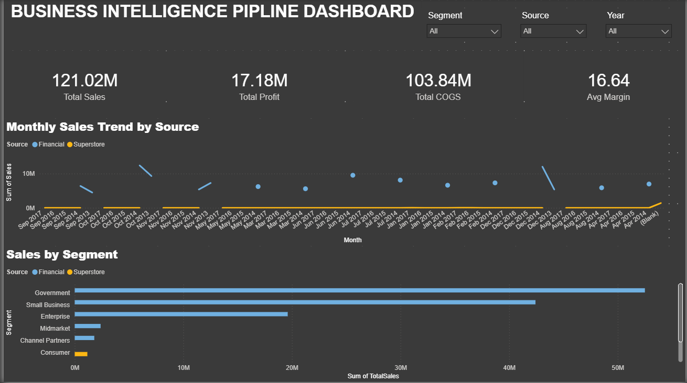
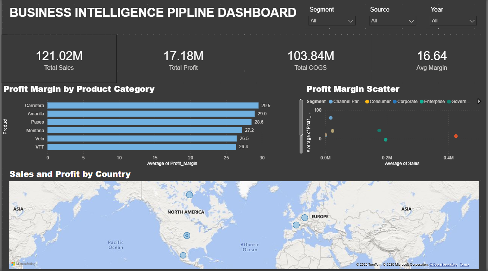

# End-to-End Business Intelligence Pipeline

## Overview
Built a complete BI pipeline merging Superstore Sales and 
Financial Sample datasets — from raw Excel files to a live 
3-page Power BI dashboard connected directly to MySQL.

## Pipeline Architecture
Raw Excel Files (Superstore + Financial Sample)
↓
Python (etl_pipeline.py) — Clean + Merge both datasets
↓
MySQL (bi_pipeline database) — Store + SQL Views for KPIs
↓
Power BI — Live 3-page executive dashboard

## Dashboard Preview

### Page 1 — Overview

### Page 2 — Drill-Down

### Page 3 — Insights

## Tools Used
- **Python (pandas)** — ETL pipeline, data cleaning and merging
- **MySQL** — Data storage, 3 SQL views for KPI aggregation
- **Power BI** — Live database connection, 3-page dashboard

## What the Python ETL Does
1. Extracts columns from both Superstore and Financial datasets
2. Adds calculated columns: Profit_Margin, COGS, Source, Year, Month
3. Merges 9,994 + 700 rows into one unified 10,694 row dataset
4. Loads into the MySQL bi_pipeline database

## SQL Views Created
- kpi_summary — Overall KPIs by Source and Year
- segment_performance — Sales and profit by segment
- country_performance — Sales and profit by country

## Dashboard Pages
- **Page 1 Overview** — KPI cards, monthly trend, segment bars
- **Page 2 Drill-Down** — Country map, product margins, scatter plot
- **Page 3 Insights** — Top/Bottom countries, business recommendations

## Key Findings
- The government segment generates 3x more profit than Enterprise
- European markets (Germany, France) average 28.5% margin
  vs US Superstore 12.4%
- Q4 consistently outperforms across both datasets

## Datasets Used
- Superstore Sales Dataset (Kaggle)
- Microsoft Financial Sample Dataset (Microsoft Docs)
